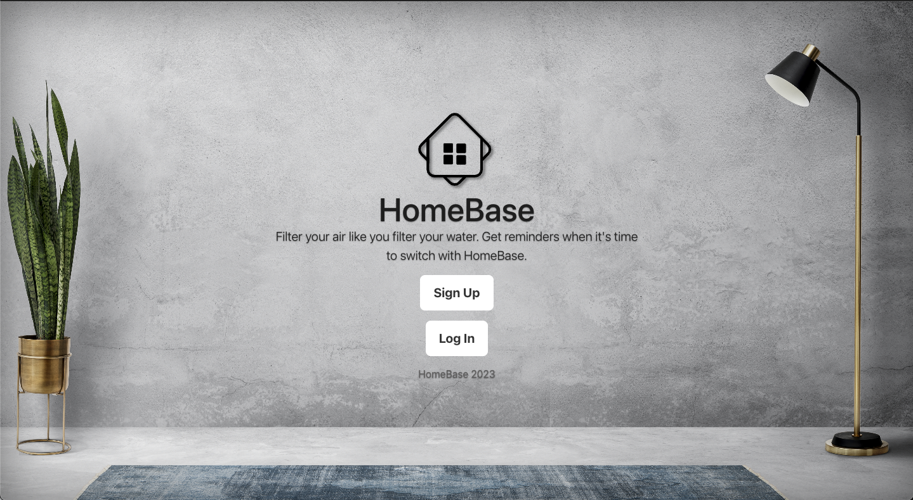

# team-418

Project Name: HomeBase

Description: A virtual homeowner’s manual to hold information about consumables for a home that sends email reminders and generates links to purchase items needed. To limit the project we focused on HVAC air filter replacement since it is common to almost all houses but is easily forgotten. The program will take and store air filter size information, issue email reminders at set intervals, and allow user account creation and management.

Base Feature List:
User Account Creation and Management: User can create and manage accounts
Full CRUD Functionality: Users can save, read, edit, and delete filter size information.
Relational Database: Filter size information stored in a MySQL database
External API Usage: SendGrid API for email reminders and Serp API for Google Shopping results

Additional Features:
Users can mark filter as changed
Google search for filters in database
Track filter change history
Track email notification history

Projected Tech Stack:
React for front end
Spring Boot for back end
MySQL for database
SendGrid API for email reminders and Serp API for item link

Members: Austin H., Brittney E., Liam C

